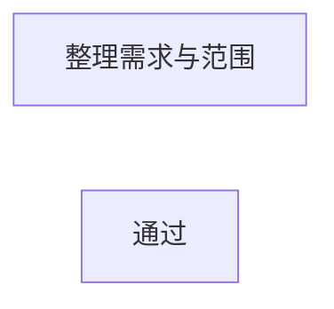
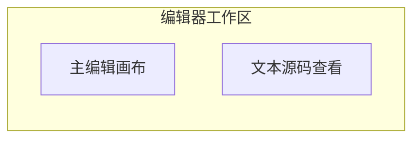

# Diagram Rules

## Node Semantics

In the editor, a node has:
- `title`
- `description`

In Mermaid source, store them like this:

- node ID: title-derived and Mermaid-safe
- node label: description only

Preferred pattern:



### Why

- IDs stay stable enough for edges and tooling
- Relationships stay on edges
- The label remains user-facing
- The result stays close to standard Mermaid conventions

## Node ID Rules

- Use Mermaid-safe characters only
- Prefer a title-derived base plus a short unique suffix
- Do not encode full relationship semantics into the ID
- Do not encode subgraph hierarchy into the ID

Good:
- `产品说明_a7c`
- `评审完成_p4k`
- `接口层_16l`

Avoid:
- `N1`
- `评审完成__R02__P4K`
- `产品说明_到评审完成_通过`

## Edge Rules

- Put semantic relation on the edge, not the node ID

Examples:

```mermaid
产品说明_a7c -->|通过| 评审完成_p4k
产品说明_a7c -->|需修改| 评审完成_q9m
```

## Subgraph Rules

- Use `subgraph` for grouping
- Keep grouping semantics in Mermaid structure
- Do not flatten grouping into node IDs
- Standard Mermaid `subgraph` has one title field only
- If the editor exposes a group description, it must be serialized as part of the subgraph title content rather than as a private second field

Example:



## Non-Flowchart Boundary

If the user provides non-flowchart Mermaid:
- preserve it as source
- do not convert unless explicitly asked
- do not attempt to force it into the canvas graph model
