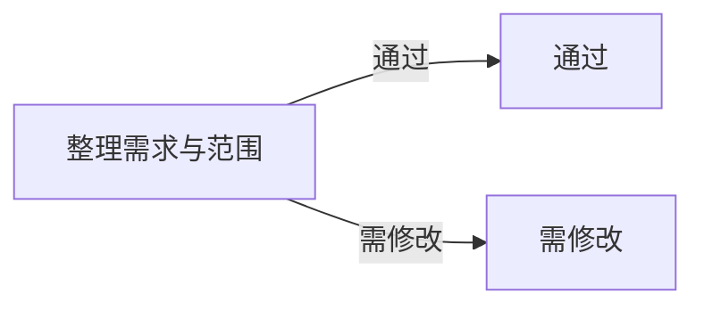
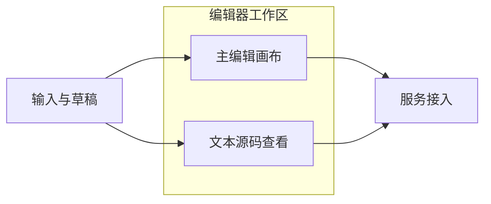
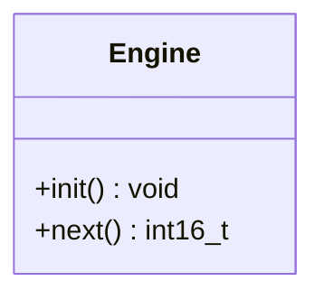
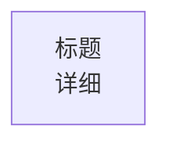

# Examples

## Example 1: Minimal Valid LMD

````md
# Product Graph Workspace

## Summary

Internal collaborative Mermaid workspace for product graphs and structured outlines.

## Diagram


## Content

- This area is regular Markdown content.
- The canvas editor should not rewrite this content into nodes unless explicitly requested.

```lths-compat
v1;vp=120,90,1
```
````

## Example 2: Grouped Flowchart

````md
# Editor Workspace

## Summary

One group feeds another.

## Diagram


## Content

附加说明写在这里。

```lths-compat
v1;vp=-220,140,0.92
```
````

## Example 3: Source-Only Mermaid

This is valid in LMD, but should be preserved as source rather than rewritten by graph tools:

````md
# Runtime Types

## Summary

Source-only class diagram.

## Diagram


## Content

This file uses a Mermaid type outside the canvas-editable scope.

```lths-compat
v1;vp=120,90,1
```
````

## Bad Patterns

Avoid these:



Reason:
- weak semantic ID
- harder for tooling and AI to read

Also avoid:


Reason:
- too much private structure in the ID
- less readable for humans and AI
