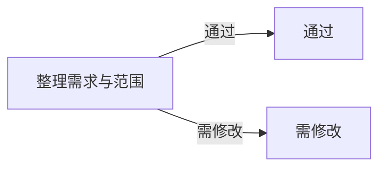

# LMD File Structure

LMD is a single-file project document format. It combines:
- Markdown-readable project content
- a standard Mermaid diagram
- a final editor-only compat layer

Its goal is to keep one `.lmd` file usable for:
- canvas editing
- source editing
- Git review
- AI context consumption
- long-term storage without separate sidecar files

The canonical LMD document layout is:

````md
# Project Name

## Summary

One short summary paragraph or more.

## Diagram


## Content

Regular Markdown content lives here.

```lths-compat
v1;vp=120,90,1
```
````

## Invariants

- The file suffix is `.lmd`.
- The file body is still Markdown.
- `## Diagram` contains one standard `mermaid` code fence.
- `## Content` contains regular Markdown.
- `lths-compat` appears at the end and stores editor-only state.
- The current format does not rely on a separate `Node Annotations` section.
- In flowchart Mermaid source:
  - node ID should be title-derived and Mermaid-safe
  - node label should store the description only
  - if the description is empty, keep a standard empty Mermaid label instead of falling back to `N1`, `N2`, etc.

## Canvas/Source Boundary

- Canvas-editable Mermaid:
  - `flowchart`
  - `graph`
- Source-only Mermaid:
  - `classDiagram`
  - `sequenceDiagram`
  - `stateDiagram`
  - `erDiagram`
  - other non-flowchart diagram types

If the diagram is source-only, preserve it instead of rewriting it through flowchart graph tools.
