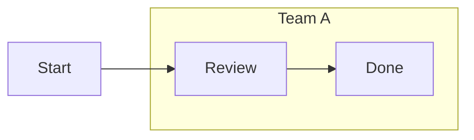

# Mermaid 空间编辑协作平台 PRD v0.2

## 1. 产品定位

- 面向企业内部的 Web 软件，部署在 Linux 服务器上，以网页形式提供访问、鉴权、存储和协作能力。
- 客户端负责主要编辑、渲染和交互计算，服务端主要负责文件存储、版本管理、协同同步、权限控制和 AI/插件调度。
- 产品交互目标为「Figma 的画布操作感 + Project Graph 的结构感 + Mermaid/Markdown 的标准文本兼容」。
- 核心文件始终是标准 Markdown 与标准 Mermaid；自由布局和工作区状态单独存储在 `layout sidecar` 中。
- 第一阶段聚焦 `flowchart`，不追求一次性覆盖全部 Mermaid 图类型。

## 2. 设计原则

### 2.1 标准优先

- `.md` 文件只保存标准 Markdown 与标准 Mermaid 代码块。
- 不在 Mermaid 源码中写入任何私有坐标、私有注释、私有扩展字段。
- 任何第三方 Mermaid 编辑器至少都能打开并正确理解语义内容。

### 2.2 画布优先

- 默认主模式是画布模式，不让用户长期停留在源码界面。
- 源码编辑是独立模式，而不是常驻侧栏。
- 用户应能像在 Figma 中一样快速框选、拖拽、连接、对齐和组织结构。

### 2.3 轻量优先

- 产品首先是公司内部协作工具，不做浏览器扩展、不做插件市场、不做 Electron 桌面壳。
- 服务器不承担大规模图形运算，绝大多数渲染和布局运算在浏览器本地完成。
- 功能设计优先减少模式切换和界面噪音，避免工具臃肿。

### 2.4 协同与平台优先

- 文档应支持多人同时编辑、评论、回溯和权限控制。
- AI 与插件能力不是外挂，而是平台能力的一部分。
- 对外能力优先通过 SDK、命令系统和服务接口提供，而不是直接暴露底层实现。

## 3. 用户价值

### 3.1 使用者视角

- 快：创建节点、连线、分组、切换方向、导出文档都要快。
- 顺：交互应接近 Figma，少弹窗、少表单、少复杂设置。
- 简：默认界面只保留最常用能力，把高级能力放到右侧属性区和命令面板。
- 通用：既能画流程图、架构图、知识图谱，也能承接项目关系图和 AI 生成草稿后的人工整理。

### 3.2 开发者与平台视角

- 稳：标准 Mermaid 语义不能被工作区特性污染。
- 可扩展：后续可增加更多图类型、布局算法、协同能力和 AI 工具。
- 可集成：支持 SDK、服务 API、命令调用和自动化流程。
- 可治理：具备权限、版本、审计和插件隔离能力。

## 4. 产品边界

### 4.1 V1 必须支持

- `flowchart` / `graph TD|LR|RL|BT`
- 节点与连线的可视化编辑
- 子图分组（`subgraph`）与嵌套
- 标准 Markdown / Mermaid 导入导出
- `layout sidecar` 的布局恢复
- 画布模式与源码模式切换
- 多人协同编辑
- 版本历史
- AI/插件/自动化的 SDK 与接口设计

### 4.2 V1 明确不做

- 浏览器扩展
- 插件市场
- Electron / 原生桌面客户端
- 贝塞尔/直角路由手工控制点
- 非标准字体、图标上传、任意视觉图层效果
- 一次性支持全部 Mermaid 图类型

## 5. 文档与数据模型

### 5.1 核心原则

- 文档存在两层：
  - 内容层：标准 `.md`
  - 工作区层：`layout sidecar`

### 5.2 内容层

- Markdown 文件是系统中的主文档。
- Mermaid 图使用标准 fenced code block：

```md

```

- 该文件必须可以直接被 GitHub、Mermaid Live Editor、Obsidian、Notion 等兼容 Mermaid 的环境读取其语义内容。

### 5.3 工作区层

- `layout sidecar` 只保存编辑器工作区状态，不参与标准 Mermaid 语义表达。
- 推荐命名：
  - `diagram.md`
  - `diagram.layout.json`

- `layout sidecar` 可包含：
  - 文档版本号
  - Mermaid block 定位信息
  - 节点坐标、尺寸、折叠状态
  - 子图边界框
  - 视口位置、缩放级别
  - 选区与最近编辑状态
  - 协同锚点与评论锚点
  - 编辑器专用边路由提示

- 若 sidecar 丢失，系统应能仅依据标准 Mermaid 自动重新布局并继续编辑。

## 6. 标准兼容策略

### 6.1 标准模式

- 所有可导出的 `.md` 内容必须是标准 Mermaid 语法。
- 默认导出不包含任何私有布局信息。

### 6.2 编辑器增强模式

- 自由布局、吸附、视口、局部排列等能力只在编辑器内生效。
- 这些能力保存在 sidecar 中，不回写到 Mermaid 源码。

### 6.3 兼容等级

- `Strict Mermaid`
  - 只允许最稳定、最通用的 flowchart 语法。
- `Modern Mermaid`
  - 允许较新的 Mermaid 能力，但仍要求标准语法。
- `Workspace Enhanced`
  - 允许使用 sidecar 中的增强布局信息，但导出 `.md` 时仍回到标准内容。

## 7. 分组、层级与 Project Graph

### 7.1 标准语义分组

- V1 的“分组”优先映射为 Mermaid `subgraph`。
- 支持：
  - 创建子图
  - 重命名子图
  - 子图内放置节点与边
  - 嵌套子图
  - 子图方向设置

### 7.2 层级定义

- 文档层级不再按 Figma 的纯视觉 z-index 理解，而是按以下三层定义：
  - 文档层级：Markdown 文件中的 Mermaid block
  - 图结构层级：subgraph、node、edge
  - 工作区层级：画布选中、折叠、锁定、视口

- V1 不将“置顶/置底”作为标准语义承诺。
- 若后续需要视觉层级，仅作为工作区状态存在，不写入 Mermaid。

### 7.3 Project Graph 视图

- 左侧主导航使用 `Project Graph` 结构，而不是单纯图层面板。
- 该视图包含三类信息：
  - 文档树：项目、页面、Markdown 文件、Mermaid block
  - 结构树：subgraph、node、edge
  - 关系图：节点之间的连接关系、跨子图引用关系

- 目标不是模仿 Figma 图层，而是帮助用户在大型图中快速定位结构。

## 8. 界面与交互

### 8.1 整体界面

- 顶部主栏：
  - 文件名与协同状态
  - 模式切换：`画布模式` / `源码模式` / `历史模式`
  - 保存、导出、撤销、重做、评论、分享

- 左侧边栏：
  - `Project Graph`
  - `Outline`
  - `Search`
  - `Comments`

- 中央主区：
  - 无限画布
  - 网格背景
  - 缩放与平移
  - 迷你地图

- 右侧边栏：
  - 属性面板
  - 布局面板
  - AI 助手面板
  - 插件扩展面板

### 8.2 模式切换

- 默认进入 `画布模式`。
- 默认指针行为为 `选择模式`，不单独提供“移动工具”作为主模式。
- 在选择模式下：
  - 从空白区域按住左键拖动，进入框选。
  - 从节点或已选对象按住左键拖动，进入移动。
  - 从连接锚点拖动，进入连线创建。

- 画布模式：
  - 以拖拽、框选、连线为主。
- 源码模式：
  - 整屏切换为编辑器视图，类似代码编辑器。
  - 提供语法高亮、补全、错误提示、格式化和兼容性检查。
- 历史模式：
  - 查看版本、差异、评论锚点和操作记录。

### 8.3 交互状态模型

- 画布需显式区分以下交互状态：
  - `Idle`
  - `Hover`
  - `Selected`
  - `Editing`
  - `Dragging`
  - `BoxSelecting`
  - `Connecting`
  - `Panning`
  - `Readonly`

- 任一时刻只允许一个主状态生效，避免“正在编辑文本时又触发拖拽”这类冲突。
- 交互切换需有清晰反馈：
  - Hover 高亮
  - 选中描边
  - 拖拽预览
  - 连线预览
  - 锁定或只读标识

### 8.4 选择模型

- 默认选择模式下的行为规则：
  - 单击空白区域：
    - 清空当前选择。
  - 在空白区域按住左键拖动：
    - 进入框选。
  - 单击节点：
    - 选中节点。
  - 拖拽节点：
    - 若节点未选中，则先选中再移动。
    - 若节点已在多选集中，则整体移动选区。
  - 单击连线：
    - 选中连线。
  - 单击子图边框：
    - 选中子图。

- 多选规则：
  - `Shift + Click` 将对象加入或移出当前选区。
  - `Shift + Drag` 可将框选结果追加到当前选区。
  - `Esc` 清空选区并退出临时交互状态。

- 选中优先级建议：
  - 文本编辑态优先
  - 节点优先于连线
  - 连线优先于子图背景
  - 子图优先于画布空白

- 重叠对象选中时，应支持：
  - 首次点击选择最上层可交互对象
  - 再次点击在重叠对象间轮换
  - 右键菜单列出当前指针处可选对象

### 8.5 画布核心交互

- 双击空白创建节点。
- 从节点锚点拖出可直接创建连线。
- 拖到空白处释放时，可自动创建新节点并建立连接。
- `Enter` 编辑节点文本。
- `Tab` 创建子级节点或在当前结构上下文中创建关联节点。
- `Shift + Tab` 提升层级或移出当前子图。
- `Space + Drag` 平移画布。
- 滚轮缩放，支持聚焦缩放。
- 框选、多选、对齐、分布、复制、删除。
- 命令面板用于快速执行“创建子图”“切换方向”“自动整理”等动作。

- 节点 Hover 时应显示：
  - 可连接锚点
  - 快速创建提示
  - 基础摘要信息

- 选区形成后应显示上下文快捷条，提供高频操作：
  - 创建子图
  - 对齐
  - 整理选区
  - 评论
  - 删除

- 右键菜单按对象上下文变化：
  - 节点：重命名、复制、删除、创建关联节点、创建子图、评论
  - 连线：编辑标签、反转方向、删除、评论
  - 子图：重命名、折叠、展开、解散、评论
  - 空白：新建节点、粘贴、整理全图、重置视图

### 8.6 视口与导航交互

- 画布支持：
  - 无限滚动
  - 网格背景
  - 迷你地图
  - 当前缩放比例显示

- 视口操作规则：
  - 滚轮默认缩放，缩放中心为光标位置
  - 触控板双指手势支持平移与缩放
  - `Space + Drag` 进入临时平移
  - 双击迷你地图区域可快速跳转
  - `Fit to Screen` 用于缩放到当前图可见边界

- 拖拽期间的视口行为：
  - 当拖拽对象接近视口边缘时自动滚动画布
  - 自动滚动速度随距离边缘远近渐进变化
  - 拖拽时保留幽灵预览，避免目标对象跳动

### 8.7 节点创建与编辑交互

- 创建节点的入口：
  - 双击空白创建孤立节点
  - 从节点锚点拖到空白创建并自动连线
  - 通过命令面板创建
  - 通过快捷键创建与当前节点相关的新节点

- 节点文本编辑规则：
  - 单击选中，双击或 `Enter` 进入编辑
  - 编辑中 `Enter` 提交
  - 编辑中 `Shift + Enter` 插入换行
  - 编辑中 `Esc` 放弃本次修改并回到选中状态
  - 点击空白处默认提交，除非文本语法非法

- 节点移动规则：
  - 拖动阈值应避免误触编辑
  - 默认启用网格吸附
  - 按住临时绕过键时可暂时关闭吸附
  - 多选节点移动时保持相对位置

- 节点复制与粘贴：
  - 复制后粘贴结果相对原位置偏移固定距离
  - 若复制内容包含内部连线，应一并复制
  - 跨文档粘贴时优先保持标准 Mermaid 结构

### 8.8 连线交互

- 连线创建规则：
  - 从节点锚点拖出后进入 `Connecting`
  - 可连接目标高亮显示
  - 非法目标不高亮
  - 释放到合法目标则创建边
  - 释放到空白区域则创建新节点并自动连接
  - 释放到非法区域则取消连线

- 连线编辑规则：
  - 单击选中连线
  - 双击边标签区域进入标签编辑
  - `Delete` 删除已选连线
  - 方向切换通过属性面板、右键菜单或命令面板完成

- 多重边策略：
  - 默认允许多重边，但在创建时提供重复连接提示
  - 若内容完全重复，可提示合并

- 自环策略：
  - V1 默认禁止自环
  - 若管理员或项目设置启用，则在兼容性提示中明确标记

### 8.9 子图与分组交互

- 子图是 V1 的标准分组方式，对应 Mermaid `subgraph`。
- 创建方式：
  - 多选后 `Ctrl/Cmd + G`
  - 右键菜单“创建子图”
  - 命令面板“Wrap in Subgraph”

- 子图交互规则：
  - 选中子图边框可整体选中子图
  - 双击子图标题可重命名
  - 拖拽节点进入子图时显示吸附高亮
  - 拖拽节点移出子图时显示结构变化预览
  - 折叠子图后，内部节点隐藏，但外部连线保留聚合展示

- 嵌套子图规则：
  - 允许嵌套
  - 当前编辑焦点应清晰显示所在子图路径
  - `Shift + Tab` 可将节点移出当前子图层级

### 8.10 对齐、排列与布局交互

- 网格吸附默认开启，但可临时按键绕过。
- 提供三种布局状态：
  - `Auto`
  - `Hybrid`
  - `Pinned`

- `Auto`：
  - 主要依赖自动布局。
- `Hybrid`：
  - 先自动布局，再允许局部拖动修正。
- `Pinned`：
  - 主要以 sidecar 中的位置为准。

- 选区形成后支持：
  - 左对齐
  - 水平居中
  - 右对齐
  - 顶部对齐
  - 垂直居中
  - 底部对齐
  - 水平均分
  - 垂直均分

- 自动布局支持三个粒度：
  - 全图整理
  - 当前子图整理
  - 当前选区整理

- 执行自动布局前应提供预览或可撤销保障。

### 8.11 源码模式交互

- 不常驻，不与画布同屏。
- 进入源码模式后，以完整编辑器体验为主。
- 支持：
  - Mermaid 语法高亮
  - Markdown 高亮
  - Mermaid block 导航
  - 错误定位
  - 一键回到画布并定位选中对象

- 进入源码模式时：
  - 默认定位到当前 Mermaid block
  - 若画布中已有选中对象，应尽量定位到对应语句附近

- 保存与切换规则：
  - 在源码模式中允许临时保留未通过解析的草稿
  - 当用户尝试返回画布时：
    - 若语法有效，则更新画布
    - 若语法无效，则保留在源码模式并提示错误
    - 用户可选择继续修复、放弃草稿或回退到上一个有效版本

- 源码到画布的映射规则：
  - 若仅文本内容变化，则尽量保留现有布局
  - 若结构变化但节点 ID 可匹配，则只对新增或失配部分重新布局
  - 若节点 ID 大范围重写，则提示可能丢失现有工作区布局

### 8.12 协同交互

- 画布模式下显示：
  - 在线成员列表
  - 实时光标
  - 实时选区轮廓
  - 当前正在编辑的节点或子图标识

- 协同编辑规则：
  - 节点文本编辑采用软锁提示
  - 若其他人正在编辑同一节点，当前用户仍可进入，但需收到冲突提示
  - 子图结构变更需广播并实时更新其他人视图

- 源码模式协同规则：
  - V1 建议采用 Mermaid block 级软锁
  - 当一名用户进入某 block 的源码编辑时，其他用户看到“正在编辑源码”的提示
  - 其他用户可只读查看、等待释放，或申请接管

- 评论交互：
  - 评论可锚定在节点、连线、子图或文档级
  - Hover 或选中对象时显示评论入口
  - 评论线程支持已解决状态

### 8.13 AI 交互

- AI 的触发入口：
  - 右侧 AI 面板
  - 命令面板
  - 选区上下文快捷条

- AI 的作用范围：
  - 当前选区
  - 当前 Mermaid block
  - 当前文档

- AI 输出形式：
  - 文本建议
  - 结构变更预览
  - 命令批次预览
  - 兼容性修复建议

- AI 应用规则：
  - 不允许静默覆盖用户内容
  - 所有 AI 结果都需先预览
  - 用户可逐条接受、部分接受或全部拒绝
  - AI 改动进入撤销栈并写入审计

### 8.14 快捷键与效率交互

- 必须定义并文档化高频快捷键：
  - 选择全部
  - 复制 / 粘贴 / 重复
  - 删除
  - 撤销 / 重做
  - 创建子图
  - 自动布局
  - 切换源码模式
  - 搜索与命令面板

- 命令面板是高频入口，需支持：
  - 模糊搜索命令
  - 最近操作
  - AI 命令
  - 布局命令
  - 导入导出命令

- 剪贴板规则：
  - 支持复制为 Mermaid 文本
  - 支持复制为图片
  - 支持跨文档粘贴结构

### 8.15 反馈、错误与空状态

- 所有关键操作都应有即时反馈：
  - 保存成功
  - 导出成功
  - 同步失败
  - 兼容性警告
  - 协同冲突提示

- 错误提示分层：
  - 轻量提示使用 toast
  - 结构错误使用面板提示
  - 阻断型错误使用弹窗

- 空状态需覆盖：
  - 新文档空画布
  - 导入失败
  - sidecar 缺失
  - 当前无评论
  - 当前无搜索结果

- 首次使用时需提供轻量引导：
  - 如何创建节点
  - 如何拖拽连线
  - 如何进入源码模式
  - 如何创建子图

### 8.16 搜索、定位与历史交互

- 搜索面板支持搜索：
  - 节点文本
  - 节点 ID
  - 子图标题
  - 评论内容
  - Mermaid block

- 搜索结果交互：
  - 单击结果定位到画布对象
  - 键盘上下切换结果
  - 在画布中高亮搜索命中
  - 若对象在折叠子图中，应自动展开并定位

- 历史模式交互需支持：
  - 时间线浏览
  - 按用户筛选
  - 按操作类型筛选
  - 查看某次变更影响的节点、连线、子图

- 版本对比应至少提供：
  - Markdown / Mermaid 内容差异
  - 结构差异摘要
  - 布局变更摘要

- 恢复规则：
  - 支持恢复整个文档版本
  - 支持将旧版本复制为新分支草稿
  - 恢复前需提示覆盖范围

### 8.17 导入导出、保存与权限交互

- 导入交互支持：
  - 文件选择器导入
  - 拖拽文件到画布导入
  - 粘贴 Mermaid 文本导入

- 导入处理流程：
  - 自动识别 Markdown 中的 Mermaid block
  - 若存在 sidecar，则尝试自动关联
  - 若语法不兼容，则展示兼容性报告与修复建议
  - 若一个文档中存在多个 Mermaid block，则允许用户选择目标 block

- 导出交互支持：
  - 导出标准 Markdown
  - 导出 SVG / PNG / PDF
  - 导出包含 sidecar 的工作区包

- 导出前应允许配置：
  - 导出范围：当前选区 / 当前 block / 整个文档
  - 背景：透明或纯色
  - 页面尺寸与缩放

- 保存策略：
  - 默认自动保存
  - 顶部栏显示保存中、已保存、保存失败状态
  - 网络异常时保留本地草稿并提示稍后重试

- 权限交互：
  - 只读用户可查看、搜索、导出
  - 可评论用户可新增评论但不能修改结构
  - 可编辑用户可执行画布和源码修改
  - 管理员可管理成员、权限和版本恢复

- 只读态反馈：
  - 画布仍可导航与选择
  - 所有写操作入口禁用并显示原因
  - AI 若涉及写入，仅允许生成建议，不允许直接应用

## 9. 功能需求

### 9.1 节点

- 创建、编辑、删除节点
- 支持标准 flowchart 节点形状
- 支持节点文本编辑
- 支持链接
- 支持 class / style 映射
- 支持节点折叠与展开作为工作区状态

### 9.2 连线

- 从源节点连接到目标节点
- 支持标准箭头类型与标准标签文本
- 支持方向切换
- 支持边样式映射到标准 Mermaid 可表达范围
- 禁止自环作为默认行为，可在设置中放开

### 9.3 子图

- 多选创建子图
- 拖拽节点进出子图
- 子图标题编辑
- 子图折叠与展开
- 子图嵌套

### 9.4 自动布局

- 支持整图自动布局
- 支持对子图内局部自动布局
- 支持按方向切换 `TD/LR/RL/BT`
- 支持“整理当前选区”

### 9.5 导入导出

- 导入：
  - `.md`
  - `.mmd`
  - 粘贴 Mermaid 代码

- 导出：
  - 标准 Markdown
  - SVG
  - PNG
  - PDF

- 工作区保存：
  - Markdown
  - layout sidecar

### 9.6 协同

- 多人同时编辑
- 实时光标和选区显示
- 评论与评论锚点
- 历史版本与回滚
- 文档锁定与冲突提示
- 只读、可评论、可编辑、管理员权限

### 9.7 AI 助手

- AI 可读取当前文档、当前 Mermaid block 和当前选区上下文。
- AI 可执行受控动作：
  - 生成 Mermaid 初稿
  - 重构节点命名
  - 自动整理结构
  - 从文本生成流程图
  - 从现有图生成说明文档
  - 对图提出兼容性修复建议

- AI 不能绕过权限系统直接写入最终文档。
- AI 产生的改动必须以命令或建议形式进入编辑器，再由用户确认。

## 10. 同步策略

### 10.1 核心原则

- Markdown/Mermaid 是内容真相源。
- sidecar 是工作区真相源。
- 协同状态是会话真相源。

### 10.2 图形到源码

- 节点、边、子图的结构性修改应立即同步到 Mermaid AST，再回写文本。
- 布局修改只更新 sidecar，不改写 Mermaid 内容。

### 10.3 源码到图形

- 源码模式保存或退出时重新解析 Mermaid。
- 若语义结构未变，则尽量保留现有布局。
- 若节点 ID 变化或结构重构严重，则触发布局恢复策略：
  - 保留可匹配节点的位置
  - 对新增节点自动布局
  - 对失配节点提示用户确认

## 11. 系统架构

### 11.1 部署架构

- Linux 服务器提供：
  - Web 应用静态资源
  - API 服务
  - 协同服务
  - 文档存储
  - 版本与审计
  - AI 调度服务

- 浏览器客户端负责：
  - 渲染画布
  - 节点与连线交互
  - 本地布局计算
  - 预览与导出渲染

### 11.2 服务拆分建议

- `web-app`
  - 前端页面与静态资源
- `api-server`
  - 文档、权限、项目、评论、版本接口
- `realtime-server`
  - 协同同步、在线状态、光标广播
- `storage`
  - Markdown 与 sidecar 文件存储
- `ai-gateway`
  - 统一 AI 工具编排、审计与限流
- `worker`
  - 异步导出、批处理、索引构建

### 11.3 存储建议

- 元数据：PostgreSQL
- 文件对象：S3 兼容存储或服务器文件存储
- 协同状态：Redis 或专用实时层
- 审计日志：独立日志表或日志管道

## 12. SDK 与接口设计

### 12.1 设计目标

- 先定义 SDK，再逐步开放插件能力。
- SDK 优先服务内部 AI、自动化脚本和后续插件开发。
- 所有扩展都基于统一命令与 Graph IR，而不是直接操作 UI 组件。

### 12.2 内部 Graph IR

- 统一抽象：
  - `Document`
  - `MermaidBlock`
  - `Node`
  - `Edge`
  - `Subgraph`
  - `LayoutState`
  - `Selection`
  - `Command`

- 要求：
  - 能从 Mermaid 文本解析而来
  - 能回写为标准 Mermaid
  - 能与 sidecar 做稳定映射

### 12.3 SDK 能力边界

- 文档读取
- 图结构遍历
- 结构变换
- 命令执行
- 选择区读取
- 面板扩展
- 工具栏扩展
- 导入导出扩展
- AI 工具注册

### 12.4 命令系统

- 所有修改都应通过命令总线执行。
- 命令需具备：
  - 可撤销
  - 可重做
  - 可审计
  - 可协同广播
  - 可被 AI 调用

- 示例命令：
  - `createNode`
  - `updateNodeText`
  - `connectNodes`
  - `createSubgraph`
  - `moveSelection`
  - `applyAutoLayout`
  - `rewriteMermaidBlock`

### 12.5 AI Tool API

- 为 AI 提供受控工具，而不是直接提供数据库写权限。
- 工具建议包括：
  - `getCurrentDocument`
  - `getCurrentBlock`
  - `getSelection`
  - `proposeGraphChanges`
  - `runLayout`
  - `validateMermaidCompatibility`
  - `applyCommandBatch`

- 所有 AI 调用必须经过：
  - 权限校验
  - 速率限制
  - 审计记录
  - 用户确认或策略确认

### 12.6 插件接口预留

- 即使 V1 不做插件市场，也要预留插件宿主能力。
- 插件类型建议：
  - `panel`
  - `tool`
  - `transform`
  - `importer`
  - `exporter`
  - `ai-tool`

- 插件必须运行在受限上下文中，不直接获取敏感凭据。

## 13. 性能目标

- 单图目标规模：
  - 节点 `<= 3000`
  - 边 `<= 6000`

- 常规编辑目标：
  - 常见团队文档图在主流办公电脑上保持流畅拖拽和缩放
  - 画布操作延迟可接受
  - 大部分操作在本地完成，不依赖服务端即时计算

- 优化方向：
  - 视口裁剪
  - 增量渲染
  - Worker 中执行布局和解析
  - 按需加载源码模式和历史模式

## 14. 安全与治理

- 企业登录与单点登录预留
- 文档级权限控制
- 操作审计
- AI 调用审计
- 插件沙箱
- 文件版本留痕

## 15. 里程碑

- M1
  - flowchart 基础编辑
  - Markdown / Mermaid 导入导出
  - sidecar 布局恢复
  - 画布模式 / 源码模式切换

- M2
  - subgraph 分组
  - Project Graph 侧栏
  - 协同编辑
  - 评论与历史版本

- M3
  - AI Tool API
  - SDK v0.1 文档
  - 布局策略完善
  - 权限与审计

- M4
  - 更多 Mermaid 图类型评估
  - 插件宿主能力开放
  - 企业集成能力完善

## 16. 当前结论

- 这不是一个“把 Mermaid 画图化”的小工具，而是一个“以标准 Mermaid 为内容层、以空间编辑为工作区层、以协同与 AI 为平台层”的企业内部产品。
- V1 的关键不是功能多，而是先把三件事做稳：
  - 标准 Mermaid 不被污染
  - 画布交互足够快
  - SDK 与 AI 接口从第一天就有清晰边界
